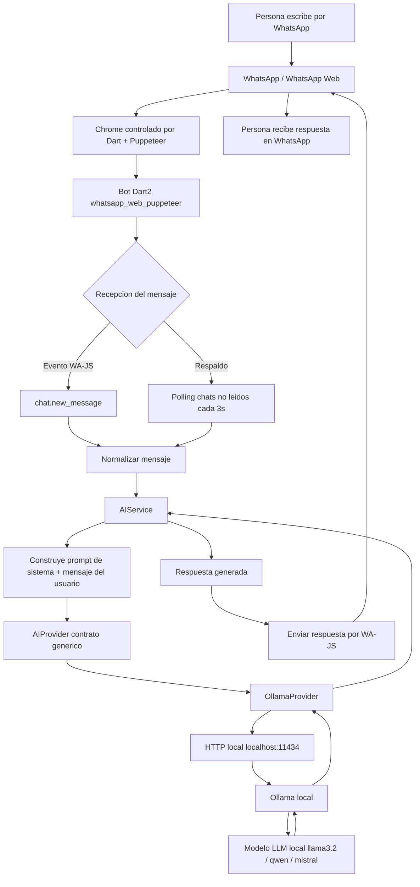
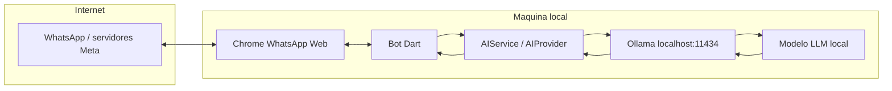
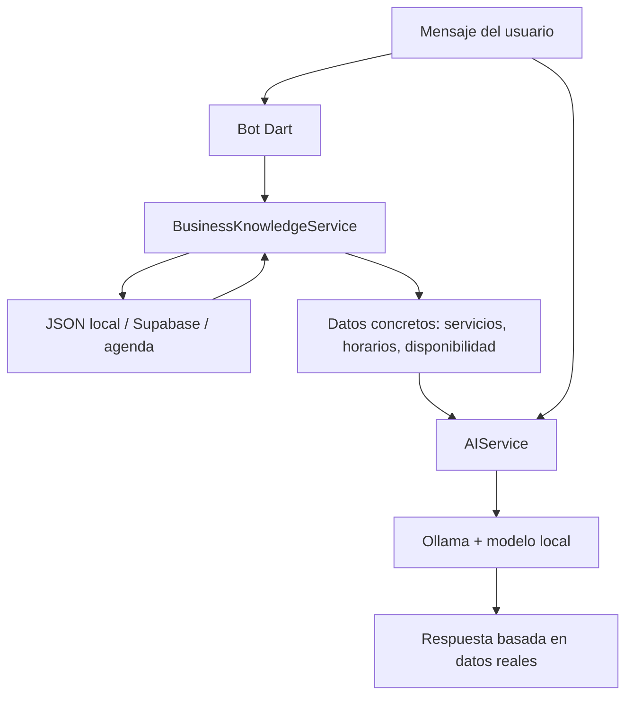

# Diagrama del bot WhatsApp + IA local

Este documento explica, a nivel ejecutivo, que hace el nuevo bot Dart2 y donde entra la IA local.

## Idea principal

El bot usa WhatsApp Web para recibir/enviar mensajes, pero usa una capa de IA local para generar respuestas. La IA no se llama directo desde WhatsApp: el mensaje pasa primero por el bot Dart, luego por un servicio generico de IA, y finalmente por Ollama local.

## Diagrama de flujo



## Que queda local y que usa internet



- **Si usa Ollama local**, el prompt hacia la IA va a `localhost:11434`, es decir, a la misma computadora.
- **WhatsApp Web si usa internet**, porque necesita conectarse a WhatsApp para recibir y enviar mensajes.
- **No se usan tokens de OpenAI/Anthropic** en esta configuracion.
- **NanoClaw no se usa como dependencia**: se tomo el enfoque modular de adaptadores.

## Responsabilidad de cada pieza

| Pieza | Responsabilidad |
| --- | --- |
| WhatsApp Web | Canal de entrada/salida de mensajes |
| Chrome + Puppeteer | Mantener la sesion web vinculada por QR |
| Bot Dart2 | Orquestar mensajes, eventos, polling y respuestas |
| `AIService` | Armar el prompt y pedir respuesta al proveedor |
| `AIProvider` | Contrato para cambiar proveedores de IA |
| `OllamaProvider` | Implementacion HTTP contra Ollama local |
| Ollama | Ejecutar modelos locales y exponer API |
| Modelo LLM | Generar la respuesta inteligente |

## Como se arma la respuesta

El mensaje del usuario no se manda solo al modelo. Antes se le agrega contexto:

```text
Eres un asistente de WhatsApp para un negocio que trabaja por citas.
Responde siempre en español.
Se breve, amable y claro.
No inventes disponibilidad, precios, ubicaciones ni datos medicos.

Mensaje del usuario:
<mensaje recibido por WhatsApp>

Respuesta:
```

Ese texto completo llega a Ollama. Ollama se lo pasa al modelo local y devuelve la respuesta al bot.

## Punto importante para futuras mejoras

Hoy el conocimiento del bot vive principalmente en el prompt base. Para saber horarios, servicios o disponibilidad real, el siguiente paso debe ser agregar una capa de conocimiento/datos, por ejemplo:



Con esto se evita que la IA invente horarios y se obliga a responder usando datos reales del negocio.
