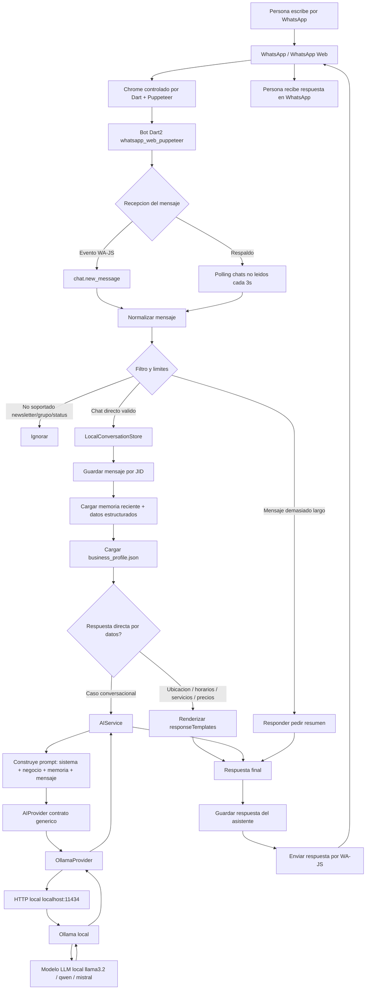
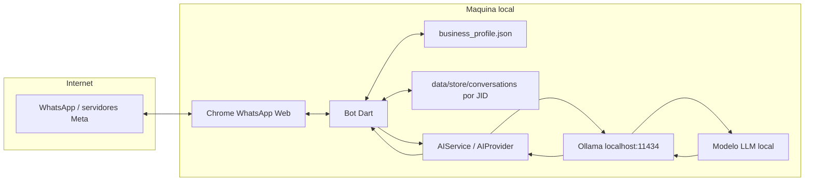
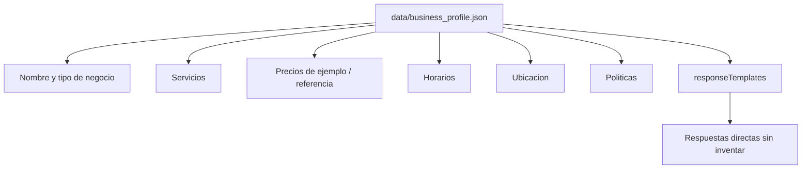

# Diagrama del bot WhatsApp + IA local

Este documento explica, a nivel ejecutivo, que hace el nuevo bot Dart2 y donde entra la IA local.

## Idea principal

El bot usa WhatsApp Web para recibir/enviar mensajes, pero el bot Dart decide primero si puede responder con datos configurados del negocio. Si la respuesta no es directa, arma un prompt con memoria local, perfil del negocio y mensaje del usuario, y lo manda a Ollama local.

## Diagrama de flujo


```mermaid
flowchart TD
    A[Persona escribe por WhatsApp] --> B[WhatsApp / WhatsApp Web]
    B --> C[Chrome controlado por Dart + Puppeteer]
    C --> D[Bot Dart2 whatsapp_web_puppeteer]

    D --> E{Recepcion del mensaje}
    E -->|Evento WA-JS| F[chat.new_message]
    E -->|Respaldo| G[Polling chats no leidos cada 3s]
    F --> H[Normalizar mensaje]
    G --> H

    H --> I{Filtro y limites}
    I -->|No soportado newsletter/grupo/status| X[Ignorar]
    I -->|Mensaje demasiado largo| Y[Responder pedir resumen]
    I -->|Chat directo valido| J[LocalConversationStore]

    J --> K[Guardar mensaje por JID]
    K --> L[Cargar memoria reciente + datos estructurados]
    L --> M[Cargar business_profile.json]
    M --> N{Respuesta directa por datos?}

    N -->|Ubicacion / horarios / servicios / precios| O[Renderizar responseTemplates]
    N -->|Caso conversacional| P[AIService]
    P --> Q[Construye prompt: sistema + negocio + memoria + mensaje]
    Q --> R[AIProvider contrato generico]
    R --> S[OllamaProvider]
    S --> T[HTTP local localhost:11434]
    T --> U[Ollama local]
    U --> V[Modelo LLM local llama3.2 / qwen / mistral]
    V --> U
    U --> S
    S --> P

    O --> W[Respuesta final]
    P --> W
    Y --> W
    W --> Z[Guardar respuesta del asistente]
    Z --> AA[Enviar respuesta por WA-JS]
    AA --> B
    B --> AB[Persona recibe respuesta en WhatsApp]
```


## Que queda local y que usa internet


```mermaid
flowchart LR
    subgraph Internet
      W[WhatsApp / servidores Meta]
    end

    subgraph Maquina local
      C[Chrome WhatsApp Web]
      D[Bot Dart]
      BZ[business_profile.json]
      LS[data/store/conversations por JID]
      S[AIService / AIProvider]
      O[Ollama localhost:11434]
      M[Modelo LLM local]
    end

    W <--> C
    C <--> D
    D <--> BZ
    D <--> LS
    D --> S
    S --> O
    O --> M
    M --> O
    O --> S
    S --> D
```


- **Si usa Ollama local**, el prompt hacia la IA va a `localhost:11434`, es decir, a la misma computadora.
- **WhatsApp Web si usa internet**, porque necesita conectarse a WhatsApp para recibir y enviar mensajes.
- **No se usan tokens de OpenAI/Anthropic** en esta configuracion.
- **NanoClaw no se usa como dependencia**: se tomo el enfoque modular de adaptadores.
- **El perfil del negocio y la memoria son locales**: `data/business_profile.json` y `data/store/conversations/`.

## Responsabilidad de cada pieza


| Pieza | Responsabilidad |
| --- | --- |
| WhatsApp Web | Canal de entrada/salida de mensajes |
| Chrome + Puppeteer | Mantener la sesion web vinculada por QR |
| Bot Dart2 | Orquestar mensajes, eventos, polling, filtros y respuestas |
| `LocalConversationStore` | Guardar memoria limitada por JID y cargar el perfil del negocio |
| `business_profile.json` | Fuente editable del negocio: servicios, precios, horarios, ubicacion, politicas y plantillas |
| `AIService` | Responder con plantillas cuando aplica o armar el prompt para Ollama |
| `AIProvider` | Contrato para cambiar proveedores de IA |
| `OllamaProvider` | Implementacion HTTP contra Ollama local |
| Ollama | Ejecutar modelos locales y exponer API |
| Modelo LLM | Generar la respuesta conversacional |


## Como se arma la respuesta

El mensaje del usuario no siempre llega al modelo. Antes pasa por reglas locales:

1. Se descartan origenes no soportados (`@newsletter`, grupos, broadcasts).
2. Se rechazan mensajes demasiado largos para evitar abuso.
3. Se guarda memoria limitada por JID.
4. Se revisa `business_profile.json`.
5. Si la pregunta es directa sobre ubicacion, horarios, servicios, tipo de negocio o precios, se responde con `responseTemplates` del JSON.
6. Si hace falta conversacion libre, se manda a Ollama con contexto.

Cuando se llama a Ollama, el prompt contiene:

```text
Eres un asistente de WhatsApp para un negocio que trabaja por citas.
Responde siempre en español.
Se breve, amable y claro.
No inventes disponibilidad, precios, ubicaciones ni datos medicos.

Conocimiento oficial del negocio:
<business_profile.json>

Memoria local de esta conversacion:
<resumen, facts y ultimos mensajes del JID>

Mensaje del usuario:
<mensaje recibido por WhatsApp>

Respuesta:
```

Ese texto completo llega a Ollama solo cuando no hubo una respuesta directa desde datos locales. Ollama se lo pasa al modelo local y devuelve la respuesta al bot.

## Conocimiento y memoria implementados

El conocimiento del negocio ya vive en un JSON local editable:


```mermaid
flowchart TD
    A[data/business_profile.json] --> B[Nombre y tipo de negocio]
    A --> C[Servicios]
    A --> D[Precios de ejemplo / referencia]
    A --> E[Horarios]
    A --> F[Ubicacion]
    A --> G[Politicas]
    A --> H[responseTemplates]
    H --> I[Respuestas directas sin inventar]
```

La memoria vive en `data/store/conversations/`, un archivo por JID. Guarda solo los ultimos 20 mensajes, recorta cada mensaje a 1000 caracteres y rechaza mensajes entrantes mayores a 2000 caracteres. Esto conserva contexto sin mandar conversaciones infinitas al modelo.