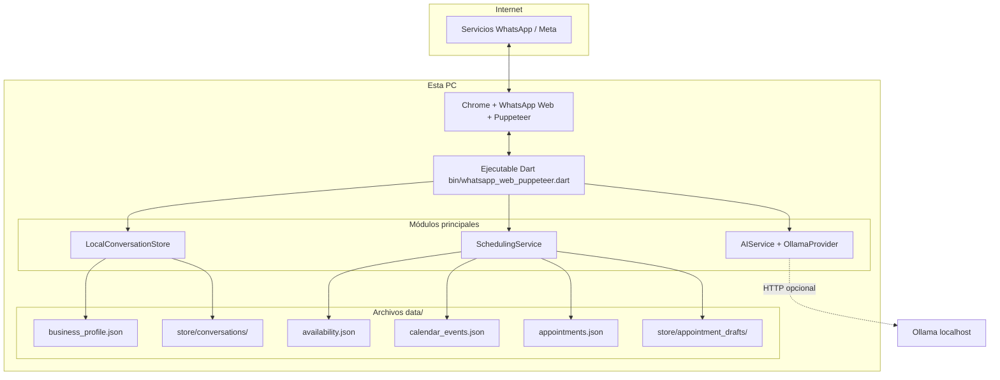
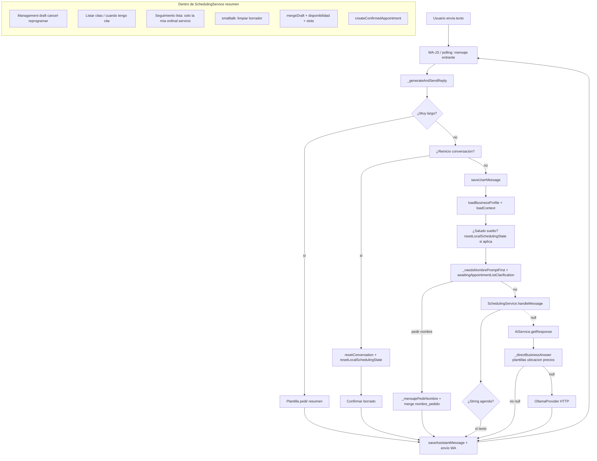
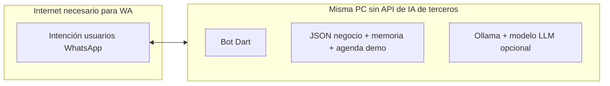
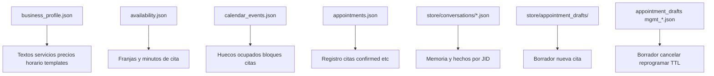

# Diagrama técnico: bot WhatsApp (Dart2) + agenda local + IA opcional

**Proyecto:** `Dart2/whatsapp_web_puppeteer`  
**Última actualización de esta guía:** mayo 2026.

Documento ejecutivo→técnico: qué componentes hay y **en qué orden** decide el código al contestar.

---

## 1. Vista ejecutiva (por capas)


```mermaid
flowchart TB
    subgraph externos [Internet]
      WS[Servicios WhatsApp / Meta]
    end

    subgraph maquina [Esta PC]
      CH[Chrome + WhatsApp Web + Puppeteer]
      APP[Ejecutable Dart bin/whatsapp_web_puppeteer.dart]
      subgraph modulos [Módulos principales]
        ST[LocalConversationStore]
        SCH[SchedulingService]
        AI[AIService + OllamaProvider]
      end
      subgraph datos [Archivos data/]
        BP[business_profile.json]
        AV[availability.json]
        CE[calendar_events.json]
        AP[appointments.json]
        CV[store/conversations/]
        DR[store/appointment_drafts/]
      end
    end

    WS <--> CH
    CH <--> APP
    APP --> ST
    APP --> SCH
    APP --> AI
    ST --> BP
    ST --> CV
    SCH --> AV
    SCH --> CE
    SCH --> AP
    SCH --> DR
    AI -.-> |HTTP opcional| OLL[Ollama localhost]
```

---

## 2. Flujo detallado del mensaje (orden real en código)

Este es el pipeline **tal como está cableado** hoy: la **agenda y reglas locales** pueden resolver **antes** de llamar a Ollama.


```mermaid
flowchart TD
    R["Usuario envía texto"] --> WPP["WA-JS / polling: mensaje entrante"]
    WPP --> GEN["_generateAndSendReply"] 

    GEN --> LONG{"¿Muy largo?"}
    LONG -->|"sí"| RLONG["Plantilla pedir resumen"]
    LONG -->|"no"| RST["¿Reinicio conversacion?"]

    RST -->|"sí"| CLALL["resetConversation + resetLocalSchedulingState"]
    CLALL --> RLONG2["Confirmar borrado"]
    RST -->|"no"| SAVE["saveUserMessage"]
    SAVE --> LOAD["loadBusinessProfile + loadContext"]

    LOAD --> HSAL["¿Saludo suelto? resetLocalSchedulingState si aplica"]
    HSAL --> NPRIM["_needsNombrePromptFirst + awaitingAppointmentListClarification"]

    NPRIM -->|"pedir nombre"| NOM["_mensajePedirNombre + merge nombre_pedido"]
    NPRIM -->|"no"| SCHD["SchedulingService.handleMessage"]

    SCHD --> OUT1{"¿String agenda?"}

    SCHD -.->|"null"| AIGET["AIService.getResponse"]
    NOM --> SEND
    RLONG --> SEND
    RLONG2 --> SEND
    OUT1 -->|"sí texto"| SEND["saveAssistantMessage + envío WA"]

    AIGET --> DIR["_directBusinessAnswer plantillas ubicacion precios"]
    DIR -->|"no null"| SEND
    DIR -->|"null"| OLLAPI["OllamaProvider HTTP"]
    OLLAPI --> SEND

    SEND --> WPP

    subgraph detalle_agenda ["Dentro de SchedulingService resumen"]
      direction TB
      M0["Management draft cancel-reprogramar"]
      M1["Listar citas / cuando tengo cita"]
      M2["Seguimiento lista: solo la mía ordinal servicio"]
      M3["smalltalk: limpiar borrador"]
      M4["mergeDraft + disponibilidad + slots"]
      M5["createConfirmedAppointment"]
    end
```

**Notas rápidas**

- **`awaitingAppointmentListClarification`**: evita que el ejecutable bloquee con “pide nombre” cuando el usuario está **aclarando una lista de citas** (“solo la mía”, “la 2”).
- **`isSlotAvailable`**: comprueba rejilla laboral + aviso mínimo + huecos contra **calendar_events**, no solo “primeros N slots”.
- **`_parsePreferredTime`**: evita confundir el **día** del formato `DD/MM/AAAA` con la **hora**.

---

## 3. Piezas locales vs internet


```mermaid
flowchart LR
    subgraph NET [Internet necesario para WA]
      W[Intención usuarios WhatsApp]
    end

    subgraph LOC [Misma PC sin API de IA de terceros]
      D[Bot Dart]
      J[JSON negocio + memoria + agenda demo]
      O[Ollama + modelo LLM opcional]
    end

    W <--> LOC
```

| Componente | Rol |
| --- | --- |
| **Chrome + Puppeteer + WA-JS** | Mantener sesión WhatsApp Web; enviar/recibir texto. |
| **`LocalConversationStore`** | Memoria corta (`facts`, últimos mensajes), actualización desde texto del usuario; archivos por JID en `store/conversations/`. |
| **`SchedulingService`** | Intenciones de cita/disponibilidad; borradores; listar/cancelar/reprogramar; ocupa slot y escribe citas/eventos locales. |
| **`AIService`** | Respuestas directas desde `business_profile` (plantillas/heurísticas) o prompt a **OllamaProvider**. |
| **`OllamaProvider`** | HTTP a `OLLAMA_BASE_URL` (normalmente `localhost:11434`). |
| **JSON en `data/`** | Perfil comercial, disponibilidad, eventos, citas, borradores. |

---

## 4. Mapa de archivos de datos (demo local)


```mermaid
flowchart TD
    BP["business_profile.json"] --> T1["Textos servicios precios horario templates"]
    AV["availability.json"] --> T2["Franjas y minutos de cita"]
    CE["calendar_events.json"] --> T3["Huecos ocupados bloques citas"]
    AP["appointments.json"] --> T4["Registro citas confirmed etc"]
    CV["store/conversations/*.json"] --> T5["Memoria y hechos por JID"]
    DR["store/appointment_drafts/"] --> T6["Borrador nueva cita"]
    MG["appointment_drafts mgmt_*.json"] --> T7["Borrador cancelar reprogramar TTL"]
```

---

## 5. Cómo se arma el prompt cuando **sí** se llama a Ollama

Solo cuando no bastó agenda + plantillas:

```text
Eres un asistente de WhatsApp...
Conocimiento oficial del negocio:
(bloque desde business_profile / toPromptBlock)

Memoria local de esta conversacion:
(resumen facts mensajes recientes)

Mensaje del usuario:
(texto WhatsApp)

Respuesta:
```

---

## 6. Documentos relacionados

- `whatsapp_web_puppeteer/README.md`: cómo correrlo, `.env`, seed mayo, troubleshooting QR.
- `AI_ADAPTER_ARCHITECTURE.md`: contrato `AIProvider`, Ollama, extensibilidad.
