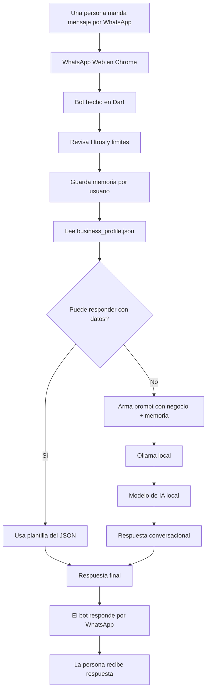

# Explicación simple: WhatsApp + Dart + Ollama

Este documento explica el flujo sin tantos términos técnicos.

## La idea en corto

Tenemos tres cosas trabajando juntas:

1. **WhatsApp Web**
  - Es el canal por donde llegan y salen los mensajes.
  - Se abre en Chrome porque el bot usa WhatsApp Web como si fuera un dispositivo vinculado.
2. **El bot en Dart**
  - Es el programa que nosotros escribimos.
  - Lee los mensajes que llegan por WhatsApp Web.
  - Decide si puede responder con datos del negocio.
  - Guarda memoria limitada de la conversacion.
  - Si hace falta, le pide una respuesta a la IA.
  - Envía esa respuesta de vuelta por WhatsApp.
3. **Ollama + modelo local**
  - Ollama corre en tu computadora.
  - El modelo, por ejemplo `llama3.2:3b`, es la IA que genera texto.
  - El bot le manda el mensaje a Ollama y Ollama responde.

## Diagrama simple




## Ejemplo paso a paso

Supongamos que una persona escribe:

```text
Hola, quiero una cita
```

El bot no manda solamente eso a la IA. Primero revisa:

- si el mensaje viene de un chat soportado;
- si no es demasiado largo;
- si ya hay memoria previa de ese numero/JID;
- si el negocio tiene datos configurados en `business_profile.json`.

Si la persona pregunta algo directo como “donde estan”, “que servicios tienen” o “cuanto cuesta una endodoncia”, el bot puede responder con plantillas del JSON sin pedirle nada a Ollama.

Si necesita una respuesta conversacional, entonces arma algo como:

```text
Eres un asistente de WhatsApp para un negocio que trabaja por citas.
Responde en español.
No inventes precios, horarios ni datos médicos.
Si quiere agendar, pide nombre, servicio, día y horario preferido.

Conocimiento oficial del negocio:
Servicios, precios, horarios, ubicacion, politicas y plantillas.

Memoria local:
Ultimos mensajes y datos detectados del usuario.

Mensaje del usuario:
Hola, quiero una cita

Respuesta:
```

Luego pasa eso a Ollama.

Ollama se lo da al modelo local.

El modelo podría responder algo como:

```text
Claro, con gusto te ayudo a agendar. ¿Me puedes compartir tu nombre,
el servicio que necesitas y qué día u horario prefieres?
```

Después Dart toma esa respuesta y la manda por WhatsApp.

## Entonces, ¿quién hace qué?


| Parte        | Qué hace                             |
| ------------ | ------------------------------------ |
| WhatsApp Web | Recibe y manda mensajes              |
| Chrome       | Mantiene abierta la sesión vinculada |
| Dart         | Controla el flujo del bot            |
| business_profile.json | Guarda datos editables del negocio |
| LocalConversationStore | Guarda memoria local por usuario |
| AIService    | Responde con plantillas o prepara el mensaje para la IA |
| Ollama       | Ejecuta modelos locales              |
| Modelo LLM   | Genera la respuesta inteligente      |


## Qué es local y qué no

La parte de IA es local:

```text
Dart -> http://localhost:11434 -> Ollama -> modelo local
```

`localhost` significa “esta misma computadora”.

Eso quiere decir que el prompt no se manda a OpenAI, Anthropic ni Claude.

Tambien son locales:

```text
data/business_profile.json
data/store/conversations/
```

Pero WhatsApp Web sí usa internet porque necesita comunicarse con WhatsApp:

```text
WhatsApp del usuario -> servidores de WhatsApp -> WhatsApp Web en Chrome
```

## Dónde entra NanoClaw

No estamos usando NanoClaw directamente.

Lo que tomamos fue la idea:

- tener una estructura modular;
- poder cambiar de proveedor de IA;
- no amarrar el bot a un solo modelo;
- usar Dart en lugar de Node/npm.

Por eso existe esta estructura:

```text
lib/ai/
  ai_context.dart
  ai_provider.dart
  ai_service.dart
  providers/
    ollama_provider.dart

lib/storage/
  local_conversation_store.dart
```

## Qué tenemos ahora

Ahora el bot puede:

- conectarse a WhatsApp con QR;
- leer mensajes;
- ignorar newsletters, grupos y broadcasts;
- guardar memoria limitada por numero/JID;
- responder datos directos desde `business_profile.json`;
- evitar mensajes enormes pidiendo un resumen;
- mandar a Ollama solo los casos conversacionales;
- responder por WhatsApp.

## Qué todavía falta

Ya existe una fuente local de conocimiento:

```text
data/business_profile.json
```

Lo que todavia falta para produccion es reemplazar esos JSON por una base como Supabase y conectar una agenda real para disponibilidad/citas confirmadas.

## Frase para explicarlo fácil

El bot de Dart es el intermediario:

> Recibe mensajes por WhatsApp, revisa datos y memoria local, usa plantillas cuando puede, consulta Ollama cuando necesita conversacion, y manda la respuesta de vuelta por WhatsApp.

