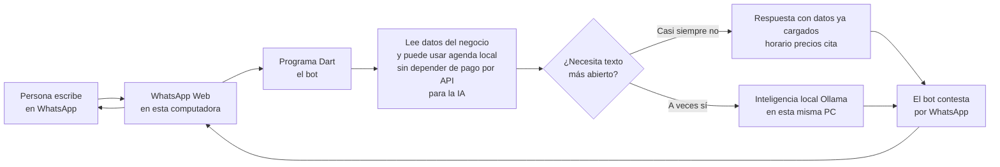

# Explicación simple: cómo funciona el bot hoy

**Para quién:** alguien **sin conocer programación**.  
**Qué proyecto:** bot de WhatsApp (`Dart2/whatsapp_web_puppeteer`) que corre en una computadora del consultorio/dev.  
**Última actualización de esta guía:** mayo 2026.

---

## En una imagen (muy simple)

Este diagrama muestra solo el camino principal: mensaje va, el programa decide, mensaje vuelve.

---

## La misma idea, en tres frases

1. El **teléfono del negocio** queda vinculado como “otro dispositivo” usando **WhatsApp Web** (Chrome en la PC).
2. Un **programa (Dart)** lee cada mensaje, **guarda un poco de memoria** por conversación, consulta **archivos de configuración** del negocio y, si el tema es **citas o disponibilidad**, usa una **agenda simulada en archivos** en la misma máquina.
3. Si hace falta una respuesta más “libre”, el programa puede pedir ayuda a **Ollama**: un modelo de IA **abierto**, instalado **en la misma PC** (sin enviar ese texto a APIs de OpenAI/Anthropic en la configuración típica). **WhatsApp sí usa internet**, porque así funciona WhatsApp.

---

## Qué es “local” y qué no

| Ubicación | Qué hay |
|-----------|---------|
| **En esta computadora** | Programa Dart, datos del negocio en JSON, memoria corta por chat, agenda de prueba, Ollama y el modelo (si instalaste Ollama). |
| **Internet** | Conexión de WhatsApp para que los mensajes lleguen y salgan. |

---

## Qué puede hacer el bot hoy (lenguaje llano)

- Saludar y **pedir nombre** al inicio cuando toca, para identificar en citas.
- Responder **horario, ubicación, servicios, precios** desde la ficha del negocio (**sin inventar** lo que no esté cargado).
- **Agendar**, **consultar próximas citas**, **cancelar** y **reprogramar** usando una **agenda local de demostración** (archivos en `data/`).
- Entender mejor frases naturales (**“solo la mía”, “lista de precios”**, día y hora en el mismo mensaje, etc.).
- Comando tipo **“reiniciar conversación”** para borrar memoria/borrador de prueba sin tocar código.

---

## Qué NO es este bot (para no confundir al jefe)

- No es aún la **app Flutter + Supabase** del producto grande descrito en `CONTEXTO_PROYECTO.md`.
- No es WhatsApp oficial de Meta (**Cloud API**); es automatización tipo **usuario con WhatsApp Web** (útiles para demos, menos para producción exigente).
- La IA local **opcional**: si Ollama no está, parte del bot **sigue funcionando** con reglas y agenda.

---

## Frase corta para explicarlo en reunión

> “Tenemos un asistente de WhatsApp que corre en nuestra PC: lee el negocio desde archivos, maneja citas de prueba en local y, cuando hace falta conversación abierta, usa un modelo de inteligencia artificial libre también en la misma máquina, sin depender de APIs de pago para eso.”

---

## Dónde está el detalle técnico

Ver hermano de este documento: **[AI_WHATSAPP_FLOW_DIAGRAM.md](AI_WHATSAPP_FLOW_DIAGRAM.md)** (diagramas y piezas del sistema).
